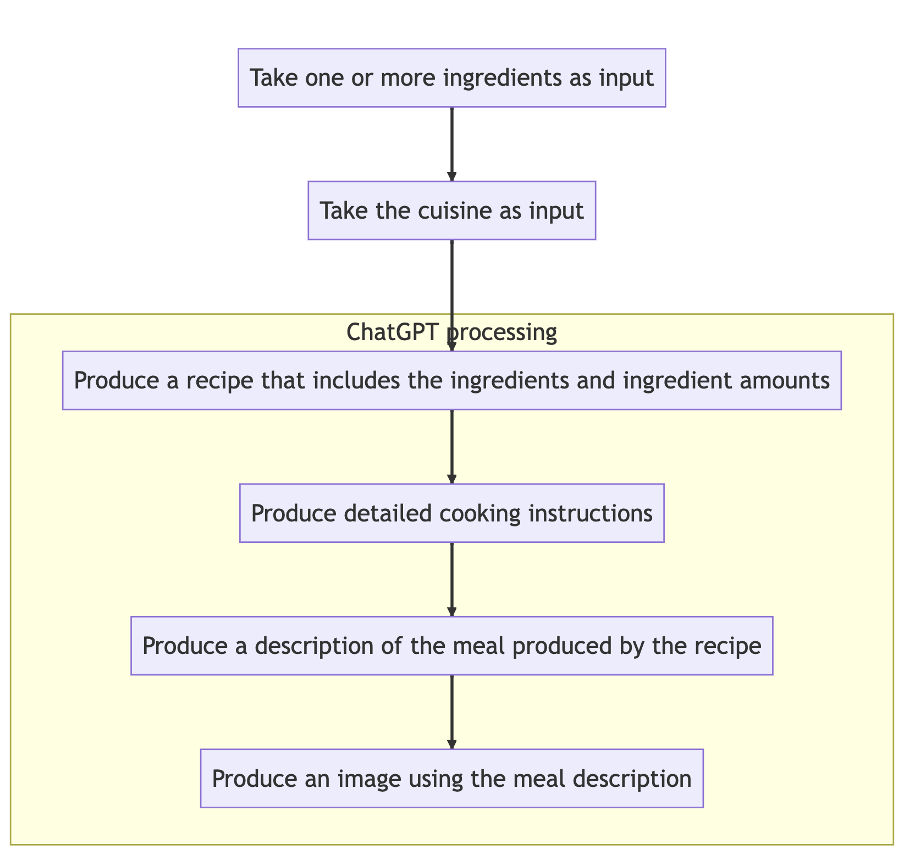

# w251-final-project

## Final Deliverables

- [Final Paper](final_deliverables/w251_final_paper.pdf)
- [Final Presentation](final_deliverables/w251_final_presentation_ChefAI.pdf)

## Using a vector database with chatgpt-retrieval-plugin 

See this [article](https://betterprogramming.pub/enhancing-chatgpt-with-infinite-external-memory-using-vector-database-and-chatgpt-retrieval-plugin-b6f4ea16ab8)

## High Level Pipeline

1. Collect images.
1. Use an object detection model (e.g., YOLO, Faster R-CNN, or Mask R-CNN) to detect and classify objects.
1. Convert object labels into a text description.
1. Use chef-ai (a GPT-4 plugin) to generate a recipe, cooking instructions and meal description given a set of ingredients.
1. Optionally generate a shopping list of items missing in the recipe. 
1. Generate a picture of the meal that matches the description.

## Running the pipeline

1. Start the local server under chef-ai (run `npm run dev`).
1. Bring up the browser and go to https://chat.openai.com/?model=text-davinci-002-plugins
1. Input the following:
  - Ingredients: chicken breast, onions, garlic, bell pepper
  - Cuisine: Mexican

