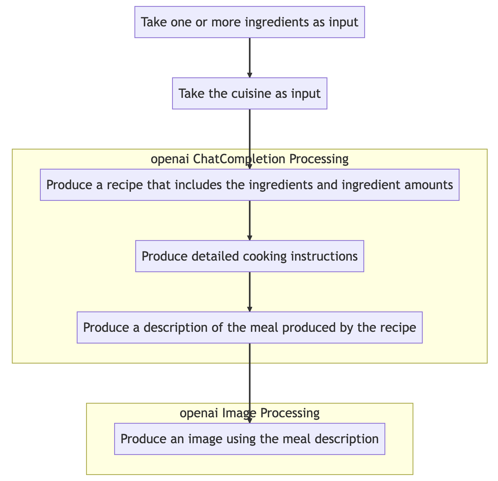

# w251-final-project

## Using a vector database with chatgpt-retrieval-plugin 

See this [article](https://betterprogramming.pub/enhancing-chatgpt-with-infinite-external-memory-using-vector-database-and-chatgpt-retrieval-plugin-b6f4ea16ab8)

## High Level Pipeline

1. Collect images.
1. Use an object detection model (e.g., YOLO, Faster R-CNN, or Mask R-CNN) to detect and classify objects.
1. Convert object labels into a text description.
1. Fine-tune a GPT-4 language model on recipe data.
1. Input the text description into the fine-tuned GPT-4 model to generate a recipe and cooking instructions.

